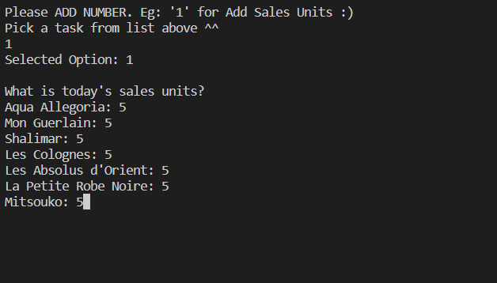

# PERFUME STOCK

Perfume Stock is a Inventory app designed for businesses which handles inventory on day to day basis. 

The inspiration for this app came from a friend of mine who work for a Luxury French perfume company. She work as a Sales Manager. Every day she performs same reptetive tasks. 

Perfume Stock App was born. 

Perfume Stock App has four main features: Add Sales Units, View Current Stock, View Warehouse Stock and Sell-Through Rate.

The app is connected to Google sheets via API. Google sheets include: Daily sales sheet, store stock sheet and Warehouse stock sheet.

This app is not just for sales people. It's very useful for stock staff and warehouse staff. They will have their own worksheets updated so it saves time by not having to update worksheets.

When user adds a sale, all worksheets gets updated in real-time.

## Features

* Welcome the User

    * Beginning of the App the user is asked to enter their name.
    * The app takes the user name input and gives them a personal welcome to the app.
     
     
    

* User App Options

    * User is given four options to choose from.
        
        * Add Daily Sales
        * View Current Stock
        * View Warehouse Stock
        * Sell-Through Rate

* User App Options (Number selection)

    * When user wants to select an option all they have to do is select the number before the option name.
    * This options was created so user does not have to keep writing the option name every time. This saves times and effort.
    * Less repetitive.
    * User friendly
     
     
    

* User Selected Option

    * This feature let's user know which option was selected.

* Add Daily Sales

    * When user selects Add Daily Sales, the terminal displays message asking user to add sales units sold.

    * Each perfume will then be displayed letting user input sale unit data.

    * Once all the perfumes are added, the users get's display message in terminal letting them know the app is updating sales.

    * Once the updated is completed, the user will see message saying sales added successfully.

    * When user adds sales, all worksheets gets updated automatically.

    * Store Stock sheet will minus current stock from sales.

    * Warehouse Stock will minus from the current warehouse stock from sales.
     
     
    

* View Current Stock

    * User get to see the latest stock in store.
    * This is updated live so if user adds a sales, this worksheet is updated so user always see the latest store stock.
     
     
    

* View Warehouse Stock

    * User can see the latest warehouse stock for the day.
    * Warehouse is updated automatically when user adds a sale. 
    * Warehouse staff save time by not having to minus stock in worksheets.
     
     
    

* Sell_Through Rate

    * Sell-through rate is used by businesses all around the world. It helps with identifying what product is selling and what is not. It helps business make forwarding decisions in stock to purchase in future. 

    * The calculation: sales units / curent stock * 100

    * This feature uses live data, so if user adds new sales units, the result for this feature will update.
     
     
    
     
     
    
     
     
    
     
     
    

# Deployment

* Visit [Heroku](https://www.heroku.com/)
* Sign Up/Login
* Select Create App
* Name App and select region
* Press Create App
* Go to Settings page
* Add config Vars
* Add Buildpacks Python and Node.js
* Go to Deploy section
* Connect to Github Repo
* Select deploy branch

# Testing

* [PEPE8 Online Testing](http://pep8online.com/)
    
    * [Results]

* No terminal errors

* Add Daily Sales Testing

    * Added sales in terminal and checked Daily_Sales Google Sheets to ensure each sale is been added correctly.

    * Checked store_stock and warehouse_stock worksheets to ensure the stock getting calculated in real-time when user adds a sale.

* View Current Stock

    * Checked with the Google sheets to make sure the result shown to user matches the worksheet.

    * Checked worksheet after adding new sale unit to ensure the worksheet results are the altest stock.

* View Warehouse Stock

    * After user adds sales, checked the warehouse worksheet to ensure it is updated with correct data.

    * Check results with worksheet to make sure ser gets the latest result from worksheet.

* Sell-Through Rate

    * Added new sales units to worksheets and then ran the Sell-Through Rate feature to check if the calculation is correct based on lastest sales units and store stock.

    * Checked the results by adding different sales units and stock to make sure the results are updated accordingly.

## Credits

* [Gitpod](https://www.gitpod.io/)
* [GitHub](https://www.gitpod.io/)
* [Heroku](https://www.gitpod.io/)
* [Google](https://www.google.com/)
* [Stack Overflow](https://stackoverflow.com/)
* [PEP8 Online](http://pep8online.com/)
* [Spell Checker](https://www.internetmarketingninjas.com/online-spell-checker.php)
* [Corporate Finance Institute](https://corporatefinanceinstitute.com/resources/knowledge/ecommerce-saas/sell-through-rate/) (Sell-Through Rate Calculation)
